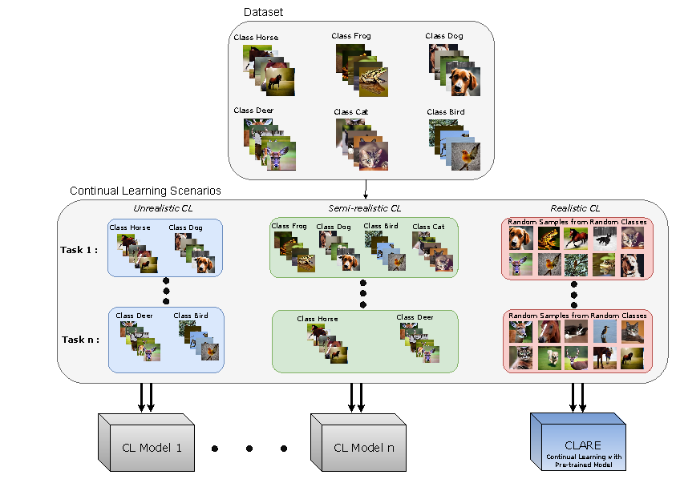

# Realistic Continual Learning Approach using Pre-trained Models

## Introduction to the Realistic Continual Learning Problem
Continual learning (CL) is essential for evaluating adaptability in learning solutions. Our research tackles catastrophic forgetting, where models lose proficiency in old tasks as they learn new ones. While many solutions exist, they often use idealized class-incremental scenarios. 

We introduce Realistic Continual Learning (RealCL), a new CL paradigm with random class distributions across tasks, moving away from structured setups.We present CLARE (Continual Learning Approach with pRE-trained models for RealCL scenarios), a pre-trained model-based solution designed to integrate new knowledge while preserving past learning <a href="https://arxiv.org/abs/2404.07729"> [paper]</a>.


<p align="center">

</p>


If you use any content of this repo for your work, please cite the following bib entry:

```bibtex
@article{Nasri2024RealisticCL,
  title={Realistic Continual Learning Approach using Pre-trained Models},
  author={Nadia Nasri and Carlos Guti'errez-'Alvarez and Sergio Lafuente-Arroyo and Saturnino Maldonado-Basc'on and Roberto J. L'opez-Sastre},
  journal={ArXiv},
  year={2024},
}
```

## How to Use

**Prerequisites**:

-  Python 3.10: We recommend using Anaconda to create a virtual environment with the required dependencies: `conda create -n clare python=3.10`
  - Activate the environment: `conda activate clare`

**Installation**: 

1. Clone the repository:

```
git clone https://github.com/gramuah/clare.git
cd clare
```
2. Install dependencies:

```
pip install -r requirements.txt
```

## Running the Experiments

To run the experiments for three CL scenarios, execute the experiments.sh script:
```
bash experiments.sh
```
Alternatively, to execute each scenario separately, modify the parameters as needed and run the following command:

```
python CLARE.py --dataset CIFAR100 --num_classes_per_task 5 --num_tasks 20 --seed 1000 --memory_size 2000 --num_passes 300 --model CLIP  --scenario unrealistic  --exp_name CIFAR100_unrealistic
```
Replace `--scenario unrealistic` with the desired scenario (`unrealistic`, `semirealistic`, or `realistic`) and adjust other parameters such as `--dataset`, `--num_tasks`, and `--memory_size` to fit your experimental setup.

## Acknowledgments 

This code is implemented based on the <a href="https://github.com/drimpossible/GDumb"> [GDumb]</a> project. Thanks to the original authors for their valuable work.


## License

This repository is released under the GNU General Public License v3.0 License (refer to the LICENSE file for details).


